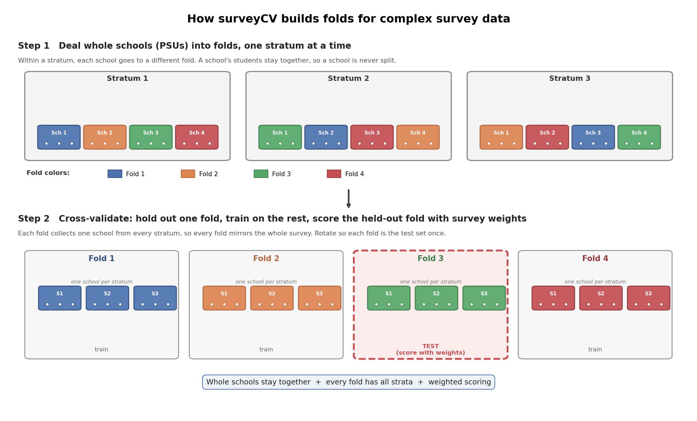
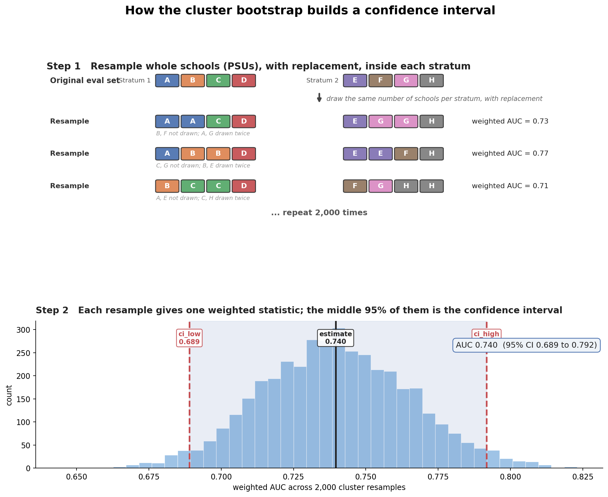

# How surveyCV does cross-validation and confidence intervals, in plain language

This covers two jobs. First, how the folds for cross-validation are built from the
survey design. Second, how the cluster bootstrap puts a confidence interval on a
number once you have a model. They are different tools for different jobs, and the
last sections walk through the bootstrap (the `cluster_bootstrap_ci` function that
replaced the hand-rolled bootstrap in the workflow) and how it handles messy data.

## The core idea

Ordinary k-fold CV shuffles individual rows into folds at random. That is fine
when every row is independent. Survey data is not: students come in schools,
schools come in groups (strata), and some students count for more than others
(weights). If you shuffle by row, two kids from the same school can land one in
the training fold and one in the test fold, and the model quietly cheats by
recognizing that school. Your CV score then looks better than the model really
is.

The fix is to make the folds respect how the data was collected. That is all
surveyCV does. It uses the three survey columns to build smarter folds.



## The three survey parameters and what each one does

**PSU (the cluster, for example the school): keep it whole.**
A school is never split across folds. Every student from a given school goes into
the same fold together. So when a school is in the test fold, the model has never
seen any student from it during training. No cheating.

**Stratum (the group the schools were sampled within): keep folds balanced.**
Within each stratum, the schools are spread across all the folds, so every fold
ends up with a mix from every stratum. No fold is accidentally all rural schools
or all one region. Each fold looks like a small version of the whole survey.

**Weight (how many real students each surveyed student represents): used for
scoring.**
When the model is graded on the held-out fold, each student's error is weighted
by their survey weight. So the score reflects the population the survey was meant
to represent, not just the raw sample.

## How a single fold actually gets built (step by step)

1. Go stratum by stratum.
2. Inside a stratum, list its unique schools (PSUs) and shuffle them.
3. Deal those schools out across the folds like cards: one to fold 1, one to fold
   2, and so on around the table.
4. Every student inherits whichever fold their school landed in.

Repeat for all strata. Because you deal within each stratum, every fold gets
schools from every stratum (that is the balance), and because you deal whole
schools, no school is ever cut in half (that is the no-leak guarantee).

Then CV runs the usual way: hold out fold 1 as the test set, train on the rest,
score it; hold out fold 2, train on the rest, score it; and so on. The only
differences from normal CV are that the held-out chunk is whole schools instead
of random rows, and the score is weighted.

## A tiny concrete example

Say you want 5 folds, and a stratum has 10 schools. surveyCV shuffles those 10
schools and assigns 2 to each of the 5 folds. Every student in those 2 schools
goes wherever their school went. Do that for all 17 YRBS strata, and each fold
ends up holding roughly 2 schools from every stratum, with no school appearing in
more than one fold.

One catch worth knowing: a stratum can only fill as many folds as it has schools.
If some stratum has just 4 schools and you ask for 5 folds, that stratum cannot
reach all 5, so surveyCV warns you and you would drop to 4 folds. That is the same
limit the original paper hit on the NSFG data.

## Confidence intervals: the cluster bootstrap

The folds above are for picking a model. Once you have a model and a number you
care about (a weighted AUC, a weighted prevalence, a per-group sensitivity), you
still need a confidence interval around it, and that interval has to respect the
same school structure. The tool for that is a cluster bootstrap. It now ships as
`cluster_bootstrap_ci`.

The idea is the mirror image of the folds. Instead of dealing each school to one
fold, you build many pretend datasets by drawing whole schools at random, with
replacement, inside each stratum. With replacement means a school can show up
twice, once, or not at all in a given draw. You compute your statistic on each
pretend dataset, and the spread of those numbers becomes your confidence interval.



Step by step:

1. Go stratum by stratum.
2. Inside a stratum, draw the same number of schools it has, at random, with
   replacement. Some schools get picked more than once, some get left out.
3. Pull in all the students from the schools you drew.
4. Compute your statistic (say weighted AUC) on that resampled set.
5. Repeat a couple thousand times. You now have a couple thousand values.
6. The 2.5th and 97.5th percentiles of those values are your 95% confidence
   interval.

Drawing whole schools, not individual students, is what makes the interval honest
for clustered data. A plain row bootstrap that resamples students ignores the
school structure and gives intervals that come out too narrow.

### Example

You write your statistic as a small function of row positions, then hand it the
PSU and stratum labels. It returns the estimate, the interval, and the bootstrap
standard error.

```python
from surveycv import cluster_bootstrap_ci
from sklearn.metrics import roc_auc_score

# y_eval, proba_eval, w_eval, stratum_eval, psu_eval are aligned arrays
def weighted_auc(idx):
    return roc_auc_score(y_eval[idx], proba_eval[idx], sample_weight=w_eval[idx])

res = cluster_bootstrap_ci(
    weighted_auc,
    clusters=psu_eval,
    strata=stratum_eval,
    n_boot=2000,
    random_state=0,
)
print(f"AUC {res.estimate:.3f} (95% CI {res.ci_low:.3f} to {res.ci_high:.3f})")
```

`res` is a small result object with `estimate`, `ci_low`, `ci_high`,
`standard_error`, `n_boot`, and `alpha`.

## How the weighted AUC is calculated

The `weighted_auc` above is just `roc_auc_score` with a `sample_weight`. Here is
what that number means and how the weights get in.

Pick one real attempter and one non-attempter at random. The AUC is
the chance the model gives the attempter the higher risk score. An AUC of 0.5 is a
coin flip, and 1.0 is perfect ranking.

The weighted version counts people by their survey weight. You look at every
attempter-against-non-attempter pair, and each pair carries the two people's
weights multiplied together. A pair is a win if the attempter has the higher
score, a tie counts as half, and a loss counts as zero. The weighted AUC is the
won weight divided by the total pair weight:

> weighted AUC = (weight of the pairs the model ranks correctly) / (weight of all pairs)

### Worked example

Four people: two who attempted (positives) and two who did not (negatives), each
with a model score and a survey weight.

| person | outcome | model score | weight |
| --- | --- | --- | --- |
| P1 | attempt | 0.80 | 3 |
| P2 | attempt | 0.40 | 1 |
| N1 | no attempt | 0.60 | 2 |
| N2 | no attempt | 0.20 | 1 |

There are 2 x 2 = 4 attempter-against-non-attempter pairs. Each pair's weight is
the two weights multiplied. A pair is a win when the attempter's score is higher:

| pair | scores | result | pair weight |
| --- | --- | --- | --- |
| P1 vs N1 | 0.80 > 0.60 | win | 3 x 2 = 6 |
| P1 vs N2 | 0.80 > 0.20 | win | 3 x 1 = 3 |
| P2 vs N1 | 0.40 < 0.60 | loss | 1 x 2 = 2 |
| P2 vs N2 | 0.40 > 0.20 | win | 1 x 1 = 1 |

Won weight = 6 + 3 + 0 + 1 = 10. Total pair weight = 6 + 3 + 2 + 1 = 12.

> weighted AUC = 10 / 12 = 0.833

Without weights the model wins 3 of the 4 pairs, so the plain AUC would be 0.75.
The weighted number comes out higher because the win involving the heavily
weighted P1 counts for more. That is the whole point: the survey weights decide how
much each person contributes, so the AUC reflects the population rather than the
raw sample.

In both the cross-validation and the bootstrap, this same weighted AUC is computed
on whatever rows are in the current fold or resample, using those rows' weights.

## How the weighted prevalence is calculated

Prevalence is even simpler. It is the share of the population that attempted, and
the survey weights decide how much each person counts. In code the statistic is a
one-liner:

```python
def weighted_prev(idx):
    return np.average(y_eval[idx], weights=w_eval[idx])
```

That is the weighted average of the 0/1 outcome: add up the weights of the people
who attempted, and divide by the total weight of everyone.

> weighted prevalence = (weight of the people who attempted) / (weight of everyone)

### Worked example

Five students, two who attempted (outcome 1) and three who did not (outcome 0),
each with a survey weight.

| person | outcome | weight | weight x outcome |
| --- | --- | --- | --- |
| S1 | attempt (1) | 4 | 4 |
| S2 | no (0) | 1 | 0 |
| S3 | no (0) | 1 | 0 |
| S4 | attempt (1) | 2 | 2 |
| S5 | no (0) | 2 | 0 |

Attempter weight = 4 + 0 + 0 + 2 + 0 = 6. Total weight = 4 + 1 + 1 + 2 + 2 = 10.

> weighted prevalence = 6 / 10 = 0.60

Counting people equally, 2 of the 5 attempted, so the plain prevalence would be
0.40. The weighted number is higher because the two attempters carry more weight
(4 and 2) than the three who did not. The weighted version answers the population
question, what share of the represented students attempted, rather than the share
of the sampled students.

The bootstrap puts a confidence interval on this number the same way it does for
AUC: it recomputes the weighted prevalence on each resample of whole schools and
reads the interval off the spread.

## How the weighted sensitivity is calculated

Sensitivity is the share of the real attempters that the model catches. Unlike AUC
and prevalence, it needs a decision threshold: the model flags a student if their
risk score is at or above the cutoff. And it only looks at the true attempters;
the non-attempters do not enter this number at all.

The weighted version asks, among the real attempters, what weighted fraction did
the model flag. In code the statistic picks out the true attempters, then takes
the weighted average of the flag (1 if flagged, 0 if missed):

```python
pred_eval = (proba_eval >= threshold).astype(int)   # flag at the chosen cutoff

def sensitivity(idx):
    attempters = idx[y_eval[idx] == 1]
    return np.average(pred_eval[attempters], weights=w_eval[attempters])
```

> weighted sensitivity = (weight of attempters the model flagged) / (weight of all attempters)

### Worked example

Take the four students who actually attempted (the non-attempters are ignored for
sensitivity). The cutoff is 0.50, so a student is flagged when their score is 0.50
or higher.

| attempter | model score | flagged at 0.50? | weight | weight x flag |
| --- | --- | --- | --- | --- |
| A1 | 0.80 | yes (1) | 4 | 4 |
| A2 | 0.70 | yes (1) | 3 | 3 |
| A3 | 0.40 | no (0) | 2 | 0 |
| A4 | 0.30 | no (0) | 1 | 0 |

Flagged weight = 4 + 3 + 0 + 0 = 7. Total attempter weight = 4 + 3 + 2 + 1 = 10.

> weighted sensitivity = 7 / 10 = 0.70

Counting attempters equally, the model catches 2 of the 4, so the plain
sensitivity would be 0.50. The weighted number is higher because the two attempters
the model caught carry more weight (4 and 3) than the two it missed (2 and 1). The
weighted version is the share of the represented attempters who get flagged, which
is what matters for how the model would perform in the population.

Because sensitivity depends on the threshold, you pick the cutoff first (often on a
validation set), then the bootstrap recomputes the weighted sensitivity on each
resample of whole schools at that same cutoff and reads the interval off the spread.

## How the cluster bootstrap handles edge cases

Real survey data is messy, especially for a rare outcome like suicide attempt, so
the function guards against a few situations.

**A resample with only one class.** For a rare outcome, a particular draw can end
up with no positive cases (or all positives), and a metric like AUC is undefined
there. The rule is simple: have your statistic return NaN when that happens, and
the function quietly drops those draws from the percentile calculation. It then
reports how many draws actually counted in `res.n_boot`, so you can see whether a
lot were lost. If every draw is degenerate, it raises a clear error instead of
handing back a meaningless interval.

**A stratum with only one school.** A stratum with a single PSU cannot add any
within-stratum variability, because resampling one school with replacement always
gives that same school back. The function warns you when this happens, since it is
a known soft spot in cluster variance estimates and you may want to collapse that
stratum with a neighbor.

**Missing the cluster labels.** The cluster (PSU) column is required. If you do
not pass it, the function stops with an error rather than silently falling back to
a plain row bootstrap, which would be the wrong method for this data.

**Bad inputs.** A non-callable statistic, an alpha outside 0 to 1, a non-positive
`n_boot`, or strata and clusters of different lengths each raise an error up front,
so you find out right away instead of getting a confusing result later.

## Which function does which part

- `design_aware_folds(strata, clusters, n_folds)`: builds the fold labels using
  the rule above (the dealing-by-school-within-stratum part).
- `SurveyFold(...)`: the same thing wrapped so scikit-learn, GridSearchCV, or
  Optuna can use it as a drop-in `cv`.
- `cross_val_score_survey(..., weights=...)`: runs the train and score loop and
  applies the survey weights when grading each fold.
- `cluster_bootstrap_ci(statistic, clusters, strata, n_boot, alpha)`: builds the
  confidence interval by resampling whole schools with replacement within strata.

Summary: for cross-validation it deals whole schools into folds within
each stratum so no school is split and every fold mirrors the survey, then grades
each fold with the survey weights; for confidence intervals it resamples whole
schools with replacement within each stratum and reads the interval off the spread
of the results.
